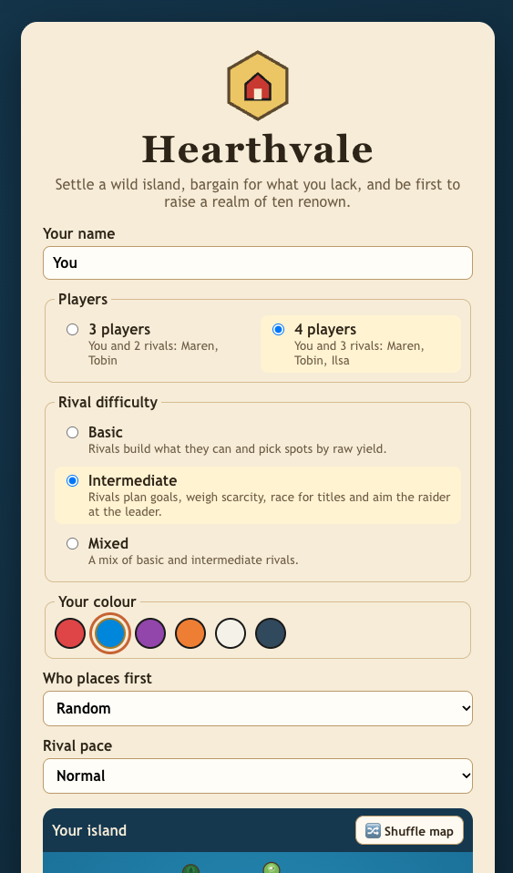
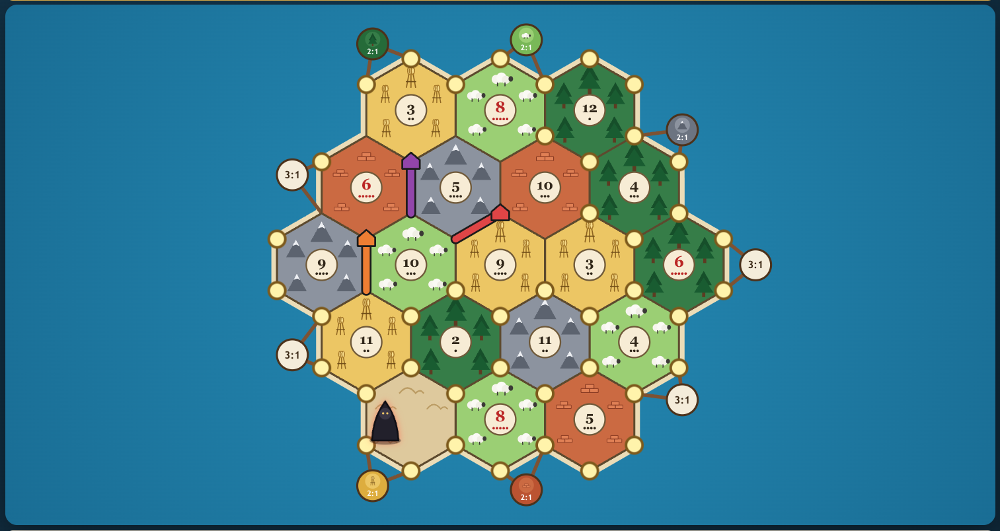

# Hearthvale

A browser strategy game of settling, trading and building on a randomly generated
island. You play against two or three computer rivals (3 or 4 players). Everything runs locally: no server,
no account, no external services. The name, artwork (hand-written SVG) and all text
are original.

## Screenshots

| Start screen | Initial placement |
| :---: | :---: |
|  |  |
| Choose 3 or 4 players, rival difficulty, your color and who places first, and preview the island. | Placing starting settlements: every legal intersection glows. |

## Run it

```bash
npm install
npm run dev        # http://localhost:5173
npm test           # rules, AI and full-game simulation tests
npm run build      # production build in dist/
npm run preview    # serve the production build
```

Requires Node 20+.

## Project layout

```
src/engine/   Pure TypeScript rules engine (no React, no DOM)
  types.ts      State, actions, cards
  geometry.ts   19-hex topology: 54 intersections, 72 paths, adjacency tables
  board.ts      Randomized valid layout (terrain, numbers, harbors)
  game.ts       createGame, applyAction (validates and rejects illegal moves), queries
  rng.ts        Seeded PRNG stored in the state, so saves replay deterministically
src/ai/       Local rule-based opponents (basic and intermediate) + headless simulator
src/ui/       React components, SVG board, controller hook, localStorage persistence
tests/        Vitest suites
```

The UI only ever calls `applyAction(state, player, action)`. The engine throws
`IllegalActionError` for anything the rules forbid, so it cannot be bypassed from the UI.

## Glossary

| Hearthvale      | Meaning                                       |
| --------------- | --------------------------------------------- |
| Timber, Clay, Fleece, Harvest, Stone | The five resources       |
| Wasteland       | The one tile that produces nothing            |
| Raider          | Blocks a tile's production and robs neighbors |
| Warden          | Development card: move the raider and rob     |
| Monument        | Development card: 1 hidden victory point      |
| Embargo         | Development card: take all of one resource from every rival |
| Bounty          | Development card: take 2 resources from the bank |
| Surveyor        | Development card: build 2 free roads          |
| Grand Highway   | Longest road of 5 or more, worth 2 VP         |
| Strongest Guard | 3 or more Wardens played, worth 2 VP          |

## Implemented features

**Board**
- The classic 19-tile island: 4 timber, 3 clay, 4 fleece, 4 harvest, 3 stone and 1 wasteland, with the standard 18 number tokens. The raider starts on the wasteland.
- Randomized every new game. The layout is validated so that 6s and 8s are never adjacent.
- Nine harbors (four 3:1 and five 2:1, one for each resource) on the coast. No two harbors share an intersection.
- Hovering or tapping any intersection or building highlights the tiles it touches. It also lists their numbers, their odds and any harbor.

**Rules**
- Initial placement over two rounds. The order reverses in round two (A B C C B A), and the second settlement pays one card from each tile it touches.
- Two-dice rolls. Settlements produce 1 card and cities 2, and the raider blocks its tile.
- Bank supply of 19 per resource with the shortage rule: if the bank can't pay everyone, nobody gets that resource, unless only one player is owed it, in which case they take what's left.
- The distance rule (no building next to another). A settlement needs a connecting road, except during setup.
- Roads must connect to your network and cannot pass through a rival's building.
- Correct costs, and limits of 15 roads, 5 settlements and 4 cities per player.
- Bank trading at 4:1, 3:1 at generic harbors and 2:1 at matching harbors.
- Player trades work the same way for everyone. On your turn you make one offer to the whole table. Every other player answers accept or decline, and rivals give a short reason. The player who offered then picks one of the accepters or withdraws the offer. Nothing else can happen while an offer is open.
  - **Rivals propose trades.** When a rival is one card short of its goal and the bank can't cover it, it offers one surplus card to everyone and then trades with the accepter who has the fewest points. Each rival makes at most one offer per turn, then waits two rounds before offering again, so offers don't flood you.
  - **Offers to you** open a dialog with Accept and Decline.
  - **Offers between rivals** appear in a live panel, showing each answer as it arrives.
- Development deck of 25 cards: 14 Warden, 5 Monument, 2 each of Embargo, Bounty and Surveyor.
  - A card cannot be played on the turn it was bought.
  - At most one card can be played per turn, and it may be played before or after rolling.
  - Monuments count automatically and stay hidden from rivals. A Monument bought this turn can still win the game.
- On a 7, everyone holding more than 7 cards discards half, rounded down. The roller then must move the raider to a different tile and steal one random card from an eligible rival next to it.
- Grand Highway: longest continuous road with 5 or more segments. It is recalculated when roads are built or cut by a rival's settlement. The holder keeps it on a tie. If the holder loses it and others tie, nobody holds it.
- Strongest Guard: 3 or more Wardens played. It changes hands only when someone strictly exceeds the holder.
- Victory at 10 points, checked on the current player's turn. The game ends immediately and rejects all further actions.

**Computer rivals** (`src/ai/ai.ts`)
- **They play fair.** Every decision is made from a redacted copy of the game (`src/ai/view.ts`). Rivals' hand contents are replaced by estimates, other players' development cards and the deck order are masked, a robbery's resource stays hidden from anyone except the thief and the victim, and the dice generator's state is removed. A test checks that an AI makes identical decisions whatever its rivals really hold.
- **Basic:** picks openings by raw pip count with some randomness, builds whatever it can afford, trades only when it has a big surplus, and places the raider loosely.
- **Intermediate:** scores openings on production probability, weights scarce resources more, and adds bonuses for resource diversity, harbors and room to expand. It aims its setup roads at the best follow-up spot. During play it picks a goal (settlement, city, road toward the best reachable spot, or development card), makes bank and harbor trades only when they complete that goal, and competes for the Grand Highway and Strongest Guard. It aims the raider at the leader's best tile without hitting itself, discards cards it doesn't need for its goal, and plays each card when it helps.
- Both levels pause between actions (adjustable pace: relaxed, normal or fast). New pieces animate in, the dice tumble, and the prompt bar and Chronicle log narrate each move.

**Interface**
- Start screen with New Game, player count (3 or 4: you plus Maren, Tobin and, for four, Ilsa), rival difficulty (Basic, Intermediate or Mixed), your color (six choices), who places first (you, a rival, or random), pace and Resume Game.
- The start screen previews the island you are about to play. **Shuffle map** rolls a new one, and every new game gets a fresh map.
- **Build straight from the map:** when you can afford a road, settlement or city, hovering a legal spot shows a see-through preview of the piece, and clicking builds it. Only legal, affordable spots respond. On touch screens, the first tap previews and the second tap builds. The build buttons still work too.
- **Development card reveals:** whenever anyone plays a card, everyone sees it flip over on the board with a short animation and its own sound:
  - **Warden:** a mounted knight charges and the raider flees. It shows the warden count, and "Strongest Guard +2" if that card wins the title.
  - **Embargo:** each victim's cards fly to whoever named the resource, with the amount taken from each player (your own losses in red) and the total collected.
  - **Bounty:** the two chosen resources drop out of the bank.
  - **Surveyor:** two roads are drawn in and a survey stake is planted.

  Rivals wait for their reveal to finish before their next move. Reveals never block clicks, and they fade while your pointer is over the board. They don't replay when you resume a saved game.
- **Cards taken from you:** when a rival robs you, an Embargo takes your cards, or you discard on a 7, each lost card lifts out of your hand and flies to the player who took it (or up to the bank). The resource slot shakes, flashes red and shows "−n", and a message says what happened, for example "Maren robbed you of 1 Harvest." You're told which card was stolen (the victim knows), but robberies between two rivals stay hidden.
- **Sound effects** for dice, roads, settlements, cities, buying and playing cards, trades, the raider, steals, discards, gathering resources, your turn starting, and victory or defeat. Rivals' moves make sound as well. All sounds are generated in the browser with the Web Audio API (no audio files), and a 🔊 toggle mutes them. The setting is remembered.
- End screen with the winner and a score breakdown (settlements, cities, titles, monuments, total).
- The game panel shows the board, your cards, development cards, all settlers (VP, hand size, cards, wardens, road length, titles), building costs, the dice, the current turn and the move history.
- Only legal actions are offered. Build buttons appear only when you can afford them and a legal spot exists, and pressing one highlights exactly the legal intersections or paths.
- Short prompts for every decision: placement, rolling, discarding, moving the raider, choosing a victim, free roads, Embargo and Bounty choices.
- Responsive layout for desktop and mobile, with large touch targets on the board.
- The game auto-saves to `localStorage` after every action. Refresh, choose **Resume game**, and it continues exactly where it stopped.

## Verification

- `tests/rules.test.ts` (37 tests) covers:
  - board validity and randomization
  - snake order and starting resources
  - production (settlements, cities, raider blocking, bank shortage)
  - distance and connection rules, costs
  - longest road (branching, cutting by a rival, tie retention, transfer)
  - raider (discard amounts, move rules, eligible victims)
  - every development card, including the bought-this-turn and one-per-turn limits
  - harbor ratios and player trades
  - victory, including the hidden Monument win
- `tests/soundCues.test.ts` checks which sound each kind of move triggers, and `tests/newGame.test.ts` covers fresh maps, the previewed seed, color choice and the starting player.
- `tests/ai.test.ts` covers opening quality, raider targeting, trade acceptance, and deterministic resume from a serialized save at every step.
- `tests/simulation.test.ts` plays **60 complete AI-vs-AI games** across all difficulty lineups. Every game must reach a winner with 10+ VP, and the rivals must use every action type: roads, settlements, cities, all four playable cards, trades, raider, steals and discards. Typical result: about 76 turns per game, and in mixed lineups Intermediate wins about 70% of the time.
- The real UI was also driven end to end in headless Chrome, with the human seat played by a script, at desktop (1400×900) and mobile (390×844) sizes. Both runs reached the victory screen with no console errors, and a mid-game page refresh with Resume restored the exact turn. A second scripted run checked the UI paths for building roads, settlements and cities, Surveyor, buying a card, bank trades, rival trade offers and turn handoff.

## Known limitations and simplifications

- **Offers are one-shot.** There is no counter-offer or haggling. A player can accept or decline, and the proposer can withdraw and try a different offer.
- **Rivals estimate hands; they don't count cards.** The AI decides only from what a player could know. It guesses a rival's hand from that rival's exact (public) hand size, split by what the rival produces. It doesn't track individual trades and steals the way a careful human card-counter might.
- **Harbor layout is not fully random.** Harbor positions follow a fixed evenly spaced pattern that is rotated randomly each game, and harbor types are shuffled.
- **The 6/8 rule is a layout constraint.** Keeping 6s and 8s apart is a common layout convention, not a base-game requirement.
- **Automatic steal.** When exactly one rival can be robbed, the steal happens automatically.
- **Free roads are skipped when blocked.** If no legal path exists, Surveyor ends early.
- **Four players at most.** The base island is used for both table sizes. There is no 5–6 player extension.
- **Single human seat.** There is one human player (no hot-seat multiplayer) and no undo.

No base-game rule needed to finish a game is missing.
